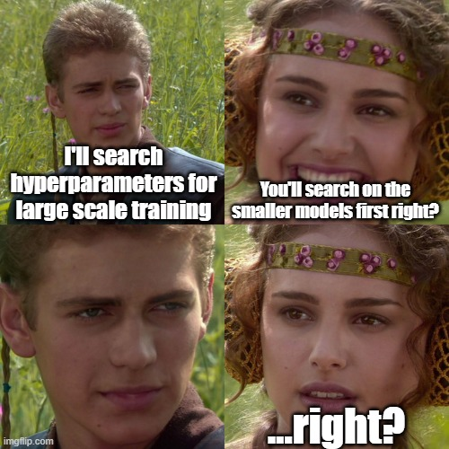
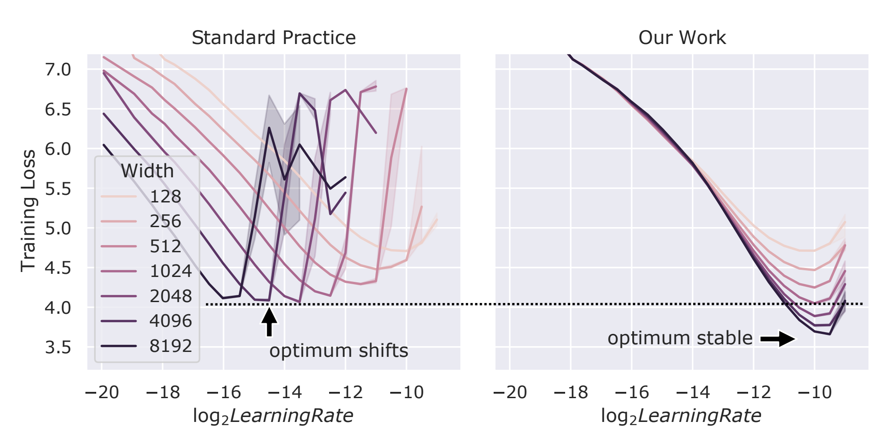
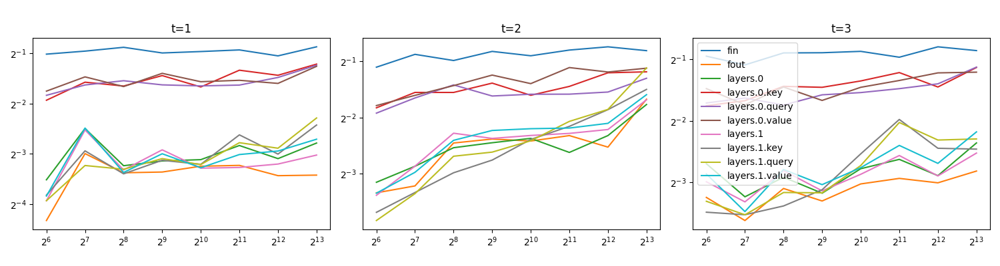

# Minimal Implementation of muP (Maximal Update Parametrization) that happens to be also Easy

> This is radical implementation of the muP algorithm (Maximal Update Parametrization) for the paper [Tensor Programs V: Tuning Large Neural Networks via Zero-Shot Hyperparameter Transfer](https://arxiv.org/abs/2203.03466) and [A Spectral Condition for Feature Learning](https://arxiv.org/abs/2310.17813), series of research driven by [Greg Yang](https://thegregyang.com/). *This is not an official implementation, which can be found [here](https://github.com/microsoft/mup).*

## What is muP?

1. You want to train a large NN with pytorch (you have a *width* as a hyperparameter)
2. You want to find optimal hyperparameters, such as learning rate, adam beta, lr scheduler, init varaince, etc (see list of hparams that are relevent [here](#list-of-hyperparameters). Note that not all hparams are relevant to muP!)
3. So of course you are going to search for the optimal hparams using the *small model*, and apply it to the *big model*... right?



But as you all know, with *default pytorch settings*, you can't do this! You often have to **search the hparams for the big model, because hparams you find on the small model is often not applicable to the big model.**

However, this can be fixed! *muP* is a method of **scaling width** so that you can search the hyperparams on the smaller model (small width), and then apply it to the big model (large width): **you can transfer the hparams from small model to big model!, that saves you a lot of time and money!**



> You see? in practice, your optimal Learing rate found with width 128 does not transfer to width 8192. But with muP, you can transfer the hyperparameters from small model to big model! Figure directly from [Tensor Programs V](https://arxiv.org/abs/2203.03466)

## How to use this repo?

This package suggest the following approach:

First, in your project, change the config so that some weird large enough prime number represents the *varying width*. By *weird*, I mean such number should not be used in your other hyperparameters of model shapes. 47 is such good number.

```python

from ezmup import Ezmup

model = MyModel(ff_width = 47 * 32, hidden_dim = 47 * 8, head_dim = 47, num_layers = 4, ...)

```

Then, you can use the ezmup package so that it changes all of the width variable to value you want.


```python
mup_engine = Ezmup(width_basis = 47, model = model) # this will treat 47 as a width variable. i.e., replace 47 occuring in all of the model as a variable length.

# do hyperparameter-search, such as scaling, with fixed width. here, we take 32.
mup_engine.change_width_as(32)

optimizer = mup_engine.get_optimizer(lr = test_lr)

# now after you get the best parameters, you can apply them to your desired width.
mup_engine.change_width_as(1024)

# if you want to use the model for other purposes, say, other frameworks just save them as state-dict, safetensors, etc.
torch.save(model.state_dict(), 'model.pt')

```


In that way, we can

1. Use muP in our own projects without too much hassle (just set the varying-width you desire to be prime number like 47! Explained later)
2. Check the correctness of muP via Coord-Checking

Oh well, this is exactly how you use this package! The code is very minimal, so do have a look as well.

## Installation

```bash
python3 -m pip install ezmup+https://github.com/cloneofsimo/ezmup.git
```

## Other methods:

The code does two things:

1. Without needing to replace the code-layers in your implementation, it changes the width variable to the value you want, by actually replacing the neural network parameters into desired ones. While doing that, it will use a standard scaling InitStd, which is also some value you can change (per layer!)

2. It also tells you the learning-rate scaling factor you need per layer, which is a varying factor depending on the width.

Say you have know that you want different learning rate for different layers such as Embedding and FFN.

Then, you can do the following:

```python
# You can do it manually by getting the parameter_name, lr_scaling dictionary.
mup_engine = Ezmup(width_basis = 47, model = model)
mup_scaling = mup_engine.lr_scaling_dict

lr_dict = {
    'embedding' : 1e-3,
    'ffn' : 1e-4
}

optimizer_groups = [
    {'params' : [p] , 'lr' : lr_dict[name] * mup_scaling[p_name] } for p_name, p in model.named_parameters()
]
optimizer = Adam(optimizer_groups, **kwargs)
```


# List of hyperparameters

Not all hyperparameters are relevant to muP. Here is the list of hyperparameters that are relevant to muP:


## So what is with the prime number?

Ok so the difficulty of muP implementation for the drop-in replacement is that you need to change the width variable *automagically*. muP requires you to identify which `fan_in` or `fan_out` refers to *infinite-width*.

So, the idea is to use a prime number as a width variable, which is then used as an indicator via dividability : if *some* shape is multiple of this prime number, then it is infinite-width. With design choice, users don't have to manually specify which shape is infinite-width, nor change the code.


## Coord-Checking

You can see how to run the coord checking in the `example.py` file. The result should looks as:




# For Developers
## Installation

```bash
git clone https://github.com/cloneofsimo/ezmup.git
cd ezmup
python3 -m pip install ".[dev]"
```

## Build docs
```bash
sphinx-apidoc -f -o docs/source ezmup
cd docs
make html
```

## Update `requirements.txt` and `requirements-dev.txt` from `pyproject.toml` (Use `pip-compile`)
```bash
pip-compile -o requirements.txt pyproject.toml
pip-compile --extra dev -o requirements-dev.txt pyproject.toml
```
